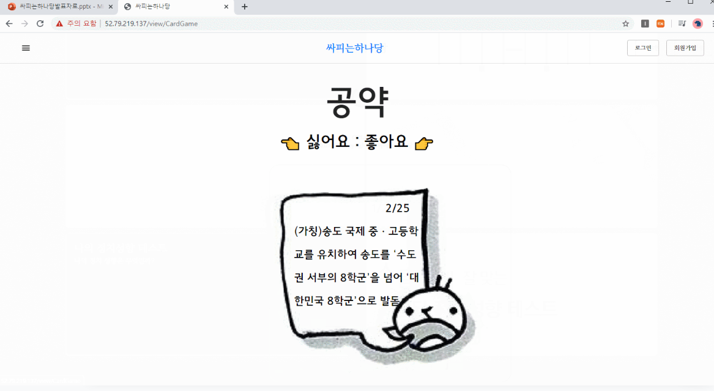
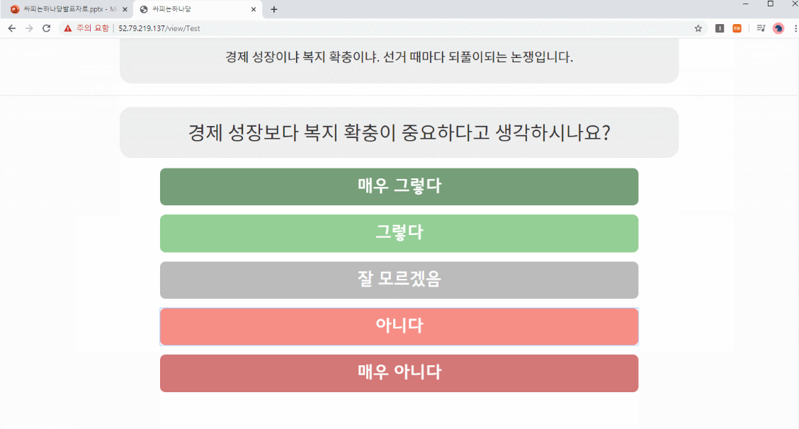
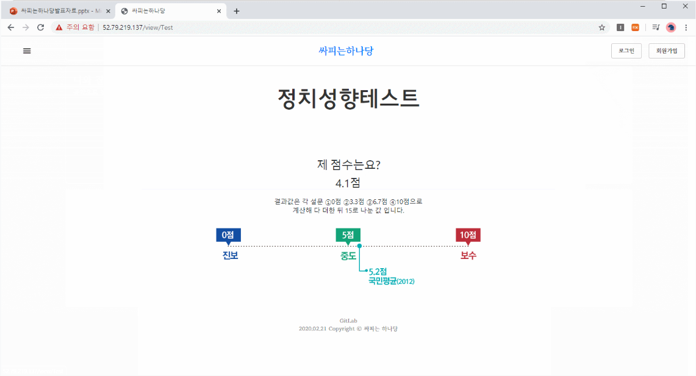

# 💡 정치에 흥미를 느낄 수 있는 사이트 💡

진행중인 선거 후보자들과 정치인에 대한 정보를 열람할 수 있고, 다양한 게임을 통해 정치에 흥미를 높일 수 있는 사이트입니다.

## 기술스택

React, Javascript, Spring Boot, MySQL, AWS

## 담당 역할

프론트엔드 개발을 맡았습니다. React 를 이용하여 선거후보자 살펴보기, 국회의원 리스트와 찾기, Redux 를 이용하여 회원가입과 로그인 기능을 구현하였습니다.

## 메인화면

메인페이지에서는 현재 진행 중인 선거의 후보자 열람, 국회의원 찾기, 나와 잘맞는 정치인 찾기, 나의 정치성향 테스트 페이지로 이동할 수 있습니다.

## 선거 후보자 화면

진행중인 선거의 후보자들의 포스터를 리스트로 구현하였습니다. 각 후보자를 클릭하면 포스터의 내용을 확인할 수 있고, 고정된 댓글창을 활용하여 의견을 남길 수 있습니다.

## 국회의원 찾기

검색을 통해 국회의원을 찾을 수 있습니다. 검색어 입력 시 서버를 통해 받아온 데이터를 필터링 하여 결과를 표시합니다. 정치인을 클릭하면 정치인의 이력과 의안, 공약 등의 정보를 확인할 수 있습니다.

## 나와 잘맞는 정치인 찾기

랜덤으로 제공되는 공약을 통해 좋아요/싫어요를 마우스로 이동을 통해 선택합니다. 이를 통해 호감도를 계산 후 가장 잘 맞는 정치인을 추천해줍니다.

## 나의 정치성향 테스트 페이지

정치적으로 의견이 나뉘는 이슈 몇가지를 통해 정치성향을 시험해볼 수 있는 테스트를 제공합니다. 문항마다 점수를 부여하여 결과로 표시합니다.